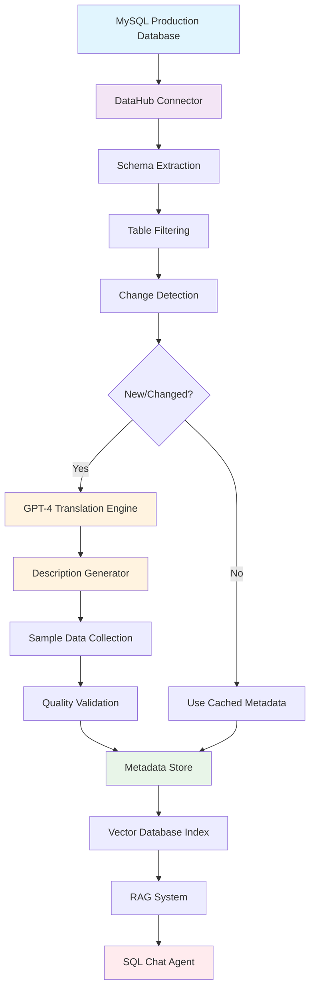

# SQL-Chat: Intelligent Database Query Agent

> An advanced AI-powered system for natural language to SQL conversion with DAG-based query decomposition and multi-threaded execution.

[](https://python.org)
[](https://flask.palletsprojects.com/)
[](https://langchain.com)
[](https://mysql.com)

## 🚀 Features

- **Intelligent Query Decomposition**: Automatically breaks down complex natural language queries into manageable sub-tasks using DAG (Directed Acyclic Graph) structure
- **Multi-threaded Execution**: Parallel processing of query tasks with thread-safe dependency management
- **ReAct Framework**: Implements Reasoning and Acting pattern for iterative problem-solving
- **RAG Integration**: Retrieval-Augmented Generation for accurate table schema matching
- **DataHub Metadata Sync**: Automated MySQL metadata synchronization with intelligent translation and enrichment
- **Memory Management**: Long-term memory system for chat context preservation
- **Tool Ecosystem**: Extensible tool framework including SQL generation, refinement, and validation
- **REST API**: Flask-based web service for easy integration

## 🏗️ Architecture

```
                    ┌─────────────────┐    ┌──────────────────┐
                    │   MySQL DB      │───▶│    DataHub       │
                    │   (Production)  │    │  (Metadata Mgmt) │
                    └─────────────────┘    └──────────────────┘
                                                     │
                                                     ▼
┌─────────────────┐    ┌──────────────────┐    ┌─────────────────┐
│   User Query    │───▶│  QuestionDAGLLM  │───▶│ DAG Decomposition│
└─────────────────┘    └──────────────────┘    └─────────────────┘
                                                         │
                                                         ▼
┌─────────────────┐    ┌──────────────────┐    ┌─────────────────┐
│ ThreadedDAG     │◀───│   DAGScheduler   │◀───│  Task Dependencies│
│ Executor        │    │  (Thread-Safe)   │    │                 │
└─────────────────┘    └──────────────────┘    └─────────────────┘
         │
         ▼
┌─────────────────┐    ┌──────────────────┐    ┌─────────────────┐
│ Thread Pool     │───▶│  ReAct Agent     │───▶│   Tool Selection │
│ (Parallel Exec) │    │  (Reasoning)     │    │                 │
└─────────────────┘    └──────────────────┘    └─────────────────┘
         │
         ▼
┌─────────────────┐    ┌──────────────────┐    ┌─────────────────┐
│   RAGTool       │    │  SQLGenerator    │    │   RefineTool    │
│ (Schema Retrieval)│  │     Tool         │    │ (SQL Validation) │
└─────────────────┘    └──────────────────┘    └─────────────────┘
         │                       │                       │
         ▼                       ▼                       ▼
┌─────────────────┐    ┌──────────────────┐    ┌─────────────────┐
│ Vector Database │    │    LLM Engine    │    │   MySQL Exec    │
│ (Schema Index)  │    │   (GPT-4/4o)     │    │   (Validation)  │
└─────────────────┘    └──────────────────┘    └─────────────────┘
```

## 📋 Prerequisites

- Python 3.8+
- MySQL 8.0+
- OpenAI API access (or compatible LLM endpoint)
- Vector database for RAG functionality

## 🛠️ Installation

### Quick Install (Recommended)

1. **Clone and install with one command**
   ```bash
   git clone <repository-url>
   cd SQL-Chat
   chmod +x install.sh
   
   # Basic installation
   ./install.sh
   
   # Install with GPU support
   ./install.sh --gpu
   
   # Install development version
   ./install.sh --dev
   ```

### Manual Installation

1. **Clone the repository**
   ```bash
   git clone <repository-url>
   cd SQL-Chat
   ```

2. **Install dependencies**
   
   **Option A: Using pip and requirements.txt**
   ```bash
   # Install core dependencies
   pip install -r requirements.txt
   
   # Optional: Install with GPU support (if available)
   pip uninstall faiss-cpu
   pip install faiss-gpu
   ```

3. **Set up environment variables**
   ```bash
   # Create .env file from template
   cp .env.example .env
   
   # Edit the .env file with your actual credentials
   vim .env  # or use your preferred editor
   ```
   
   **Required Environment Variables:**
   ```bash
   # OpenAI Configuration
   OPENAI_API_KEY=your_openai_api_key_here
   OPENAI_API_BASE=https://api.openai.com/v1
   OPENAI_MODEL=gpt-4
   
   # MySQL Database Configuration
   MYSQL_HOST=localhost
   MYSQL_PORT=3306
   MYSQL_USER=root
   MYSQL_PASSWORD=your_mysql_password
   MYSQL_DATABASE=chat2sql
   
   # DataHub Configuration
   DATAHUB_ENDPOINT=http://localhost:8080
   DATAHUB_TOKEN=your_datahub_token_here
   
   # Flask API Configuration
   FLASK_PORT_PROD=54292
   FLASK_PORT_DEV=57329
   ```

4. **Initialize database schema and DataHub sync**
   ```bash
   # Cold start: Full metadata synchronization
   python datahub_sync.py --mode cold
   
   # Warm start: Incremental metadata update
   python datahub_sync.py --mode warm
   
   # Check DataHub integrity
   python datahub_sync.py --mode check
   ```

## 🚀 Quick Start

### Starting the REST API Server

```bash
# Production mode (port 54292)
python llm_rest_api.py --port 54292

# Development mode (port 57329)
python llm_rest_api.py --port 57329
```

### Using the API

```bash
curl -X POST http://localhost:54292/query \
  -H "Content-Type: application/json" \
  -d '{
    "query": "Show me the top 5 ASes with the highest BGP coverage",
    "chatId": 123
  }'
```

### Python Integration

```python
from model.model_zoo import ModelZoo
from sql_react_prune import SQLChatAgent

# Initialize the agent
model_zoo = ModelZoo().get_model_zoo()
agent = SQLChatAgent(model_zoo=model_zoo)

# Execute query
result = agent.kickoff(
    query="What are the RPKI deployment statistics by region?",
    chat_id=123
)
print(result)
```

## 🧠 Core Components

### 1. SQLChatAgent
The main orchestrator that handles the complete query processing pipeline:
- Query classification and rewriting
- DAG-based task decomposition
- Multi-threaded execution coordination
- Result formatting and aggregation

### 2. DAGScheduler & ThreadedDAGExecutor
- **DAGScheduler**: Manages task dependencies and scheduling
- **ThreadedDAGExecutor**: Executes tasks in parallel using thread pool
- **Thread Safety**: Implements locks for concurrent access to shared state

### 3. ReAct Framework
Implements the Reasoning and Acting pattern:
```
Question → Thought → Action → Observation → Thought → Action → ... → Final Answer
```

### 4. Tool Ecosystem

#### RAGTool
- Retrieves relevant table schemas using vector similarity search
- Filters tables based on query context
- Prevents redundant schema retrieval

#### SQLGeneratorTool
- Converts natural language to SQL queries
- Uses table schema context for accurate generation
- Supports complex join operations and aggregations

#### RefineTool
- Validates generated SQL queries
- Executes queries safely with timeouts
- Provides error feedback for iterative improvement

### 5. DataHub Metadata Management
- **Automated Sync**: Intelligent synchronization of MySQL metadata to DataHub
- **Schema Translation**: AI-powered translation of Chinese schema comments to English
- **Incremental Updates**: Smart detection and updating of changed metadata
- **Quality Assurance**: Automated validation and enrichment of schema descriptions
- **Sample Data Integration**: Automatic collection and formatting of representative data samples

### 6. Memory Management
- **LongTermMemory**: Preserves chat context across sessions
- **Conversation History**: Maintains Q&A pairs for context-aware responses
- **Table Schema Caching**: Optimizes repeated schema lookups

## 🔧 Configuration

### Model Configuration
```python
# model/model_zoo.py
class ModelZoo:
    def get_model_zoo(self):
        return {
            'gpt': ChatOpenAI(
                model="gpt-4",
                temperature=0,
                max_tokens=2000
            )
        }
```

### Database Configuration
```python
# globals.py
QA_PATH = './rag_file/qa.csv'
TABLE_JSON_PATH = './rag_file/auto_dump_table_info.json'
```

### DataHub Configuration
```python
# datahub_sync.py
END_POINT = "http://192.168.17.5:48080"  # DataHub endpoint
DATAHUB_TOKEN = "your_datahub_token"     # Authentication token
```

### Threading Configuration
```python
# Adjust concurrent task limit
scheduler = DAGScheduler(max_concurrent_tasks=10)
```

## 📊 API Reference

### POST /query

Execute a natural language database query.

**Request Body:**
```json
{
  "query": "string",     // Natural language query
  "chatId": "integer"    // Chat session identifier
}
```

**Response:**
```json
{
  "msg": "OK",
  "ref": 200,
  "data": "string",      // Query result
  "chatId": 123
}
```

**Error Responses:**
- `400`: Bad Request - Missing required fields
- `404`: Not Found - Invalid endpoint
- `500`: Internal Server Error - Processing failure

## 📊 DataHub Integration

SQL-Chat features a sophisticated DataHub integration system that automatically synchronizes and enriches MySQL metadata, ensuring accurate and up-to-date schema information for enhanced query generation.

### Automated Metadata Synchronization

The system continuously monitors and synchronizes database metadata through three operational modes:

#### Cold Start Mode
- **Full Synchronization**: Complete metadata extraction from all production tables
- **Schema Translation**: AI-powered translation of Chinese comments to English using GPT-4
- **Quality Enhancement**: Automatic generation of comprehensive table descriptions
- **Sample Data Collection**: Representative data sampling for better schema understanding

```bash
python datahub_sync.py --mode cold
```

#### Warm Start Mode (Incremental)
- **Change Detection**: Smart identification of schema modifications
- **Selective Updates**: Only processes changed or new tables
- **Efficiency Optimization**: Minimizes processing overhead through differential analysis
- **Consistency Maintenance**: Ensures data integrity across updates

```bash
python datahub_sync.py --mode warm
```

#### Integrity Check Mode
- **Quality Validation**: Identifies tables with missing or incomplete metadata
- **Coverage Analysis**: Reports on schema documentation completeness
- **Error Detection**: Highlights potential synchronization issues

```bash
python datahub_sync.py --mode check
```

### Intelligent Schema Processing

#### Multi-Language Support
```python
# Automatic translation pipeline
def describe_translate(table_name: str, table_dict: dict):
    # 1. Extract schema information from DataHub
    # 2. Translate Chinese comments to English
    # 3. Generate comprehensive table descriptions
    # 4. Format and validate output
```

#### Smart Filtering System
```python
# Configurable table filtering
NO_MEANING_TABLES = [
    'user_logs', 'permission_tables', 'temp_data'
]
NO_MEANING_TABLE_PRE = ['zdel', 'backup', 'temp']
NO_MEANING_TABLE_CONTAIN = ['copy', 'archive']
```

### DataHub Features

| Feature | Description | Benefit |
|---------|-------------|---------|
| **Real-time Sync** | Continuous metadata monitoring | Always current schema info |
| **AI Translation** | GPT-powered comment translation | Multilingual schema support |
| **Sample Integration** | Automatic data sampling | Better context for SQL generation |
| **Change Tracking** | Incremental update detection | Efficient resource utilization |
| **Quality Assurance** | Automated validation checks | High-quality metadata |

### Schema Enhancement Pipeline



## 🏆 Advanced Features

### Complex Query Handling
The system can handle sophisticated queries by decomposing them into sub-tasks:

```
Query: "Compare RPKI adoption rates between Asian and European countries for the last 3 years"

Decomposition:
1. "Get RPKI data for Asian countries from 2021-2023"
2. "Get RPKI data for European countries from 2021-2023"  
3. "Calculate adoption rates for both regions"
4. "Compare the results and generate insights"
```

### Dependency Management
Tasks are executed based on their dependencies:
```
1 → 2  (Task 2 depends on Task 1)
1 → 3  (Task 3 depends on Task 1)
2 → 4  (Task 4 depends on Task 2)
3 → 4  (Task 4 depends on Task 3)
```

### Error Handling and Recovery
- **SQL Validation**: Automatic query syntax checking
- **Timeout Management**: Prevents long-running queries
- **Fallback Mechanisms**: Alternative approaches for failed queries
- **Dependency Failure Propagation**: Automatic task failure cascading


## 📈 Performance Optimization

### Multi-threading Benefits
- **Parallel Execution**: Multiple queries processed simultaneously
- **Resource Utilization**: Better CPU and I/O usage
- **Scalability**: Handles increased load efficiently

### Caching Strategies
- **Schema Caching**: Reduces database metadata queries
- **Query Result Caching**: Speeds up repeated queries
- **Vector Index Optimization**: Faster RAG retrieval
- **DataHub Metadata Caching**: Local caching of enriched schema information
- **Incremental Sync**: Minimizes DataHub API calls through change detection

### Database Optimization
- **Connection Pooling**: Efficient database connection management
- **Query Optimization**: Automatic LIMIT clause injection
- **Index Usage**: Leverages database indexes for faster lookups


**Built with ❤️ for intelligent database interactions**